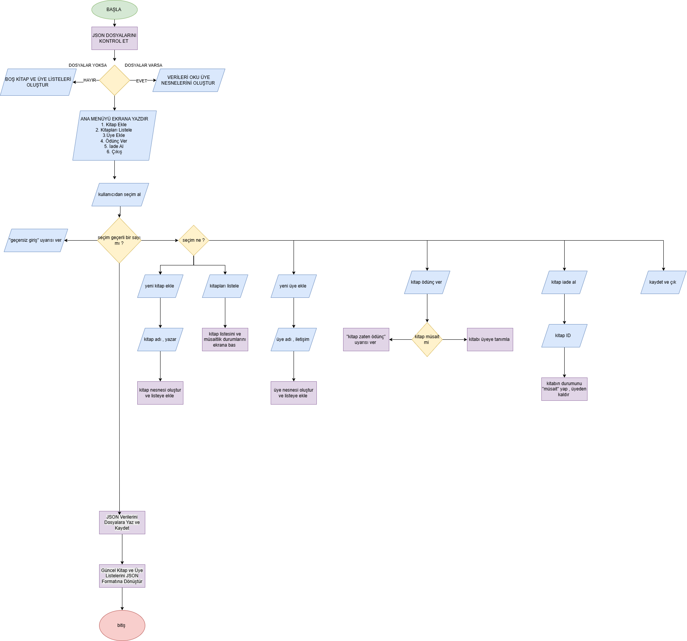

# Orion Kütüphanesi Yönetim ve Takip Sistemi

Bu proje, kütüphanelerde kitap ve üye yönetimini kolaylaştırmak amacıyla geliştirilmiş masaüstü tabanlı bir kütüphane otomasyon sistemidir. Python ve Tkinter kullanılarak geliştirilen uygulama; kitap ekleme, üye yönetimi, ödünç verme ve iade işlemlerini tek bir arayüz üzerinden yönetmeyi sağlar.
Veriler JSON formatında saklanır ve uygulama yeniden başlatıldığında kayıtlar korunur. Kullanıcı dostu arayüzü sayesinde küçük ve orta ölçekli kütüphanelerde günlük operasyonların daha düzenli yürütülmesine yardımcı olur.


---


# Projenin Amacı ve Çözdüğü Problem

Kütüphanelerde kitapların hangi üyede olduğu, hangi kitapların müsait olup olmadığı ve üyelerin ödünç alma süreçlerinin takibi manuel yapıldığında zaman almakta ve zorlaşmaktadır. Bu proje; kitap ve üye yönetimini tek bir dijital sistem altında toplayarak süreci hızlı, hatasız ve pratik bir hale getirmeyi çözmeyi amaçlar.


---


# Özellikler 

-Kitap ekleme ve silme
-Üye ekleme ve silme
-Kitap ödünç verme işlemleri
-Kitap iade işlemleri
-Mevcut kitap ve üye kayıtlarını görüntüleme
-JSON tabanlı veri saklama
-Modern Tkinter arayüzü
-Hata kontrolü ve kullanıcı bildirimleri


---


# Teknik Gereksinimler & Karşılanan Kriterler

- **Nesne Yönelimli Tasarım (OOP):** Projede gerçek nesneleri modelleyen `Kitap`, `Uye` ve iş mantığını yürüten `Kutuphane` olmak üzere 3 anlamlı sınıf kullanılmıştır.
- **Veri Kalıcılığı:** Sistemde `json` yapısı kullanılmıştır. Eklenen kitaplar, üyeler ve ödünç durumları `kutuphane_verileri.json` dosyasına kaydedilir ve program kapatılıp açıldığında veri kaybı yaşanmaz.
- **Hata Yönetimi:** Yanlış veri girişleri, boş bırakılan alanlar veya üzerinde kitap olan bir üyenin silinmeye çalışılması gibi durumlarda `try-except` blokları ve `messagebox` uyarıları ile programın çökmesi engellenmiştir.
- **Modüler Yapı:** Kod karmaşasını önlemek adına proje 3 ayrı `.py` dosyasına bölünmüştür (`models.py`, `library.py`, `main.py`).
- **Gelişmiş Özellik :** Standart konsol ekranı yerine, kullanıcı dostu ve yüksek çözünürlüklü ekranlarda da rahatça okunabilen **Dev Puntolu Tkinter GUI (Arayüz)** entegrasyonu yapılmıştır.


---


# Teknolojiler

-Python 3
-Tkinter
-JSON
-Nesne Yönelimli Programlama (OOP)


---


# Klasör Yapısı

```text
KutuphaneYonetimSistemi/
│
├── models.py                # Kitap ve Uye sınıflarının (modellerinin) bulunduğu katman
├── library.py               # Kitap ekleme, silme, ödünç/iade iş mantığı ve JSON işlemleri
├── main.py                  # Tkinter arayüz tasarımı ve uygulamanın ana giriş noktası
├── kutuphane_verileri.json  # Verilerin kalıcı olarak saklandığı veri dosyası
├── .gitignore               # __pycache__ gibi geçici dosyaların engelleme haritası
└── README.md                # Proje tanıtım ve kullanım kılavuzu
```

---

### 📊 Proje Akış Şeması

